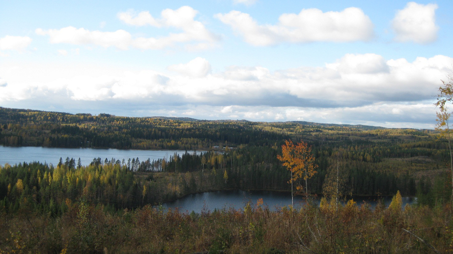





# Historiaa ja nykypäivää!
Vuoteen 2009 itsenäisen Enon kunnan alue sijaitsee Pielisjoen yläjuoksulla Pielisen kainalossa Pohjois-Karjalassa. Enon alue on nykyisin Joensuun kaupunkiin kuuluva luonnonkaunis ja virkeä taajama. Enossa on kaksi yli 1 000:n asukkaan taajamaa: Enon kirkonkylä ja teollisuuskeskus Uimaharju. Yhdistyessään Joensuuhun Enon, Pohjois-Karjalan teollistuneimman kunnan, väkiluku oli noin 6 500. Enon kirkonkylästä Joensuun keskustaan on noin puolen tunnin auto- ja junamatka. Kahden päätaajaman lisäksi Enossa on useita kyliä. Suurimpia näistä ovat Louhiojan ja Ukkolan kylät. 

Valtaväylä Pielisjoki määrittää Enon alueen menneisyyden ja nykyisyyden. Murruttuaan Uimaharjun läpi jääkauden jälkeen Pielisjoki muodosti kulkuväylän Pielisen ja Pyhäselän välille, ja Saimaalle osana Vuoksen vesistöä. Pielisjokea pitkin levisi asutus ja teollisuus Enon alueelle. Joki mahdollisti kulutustavaroiden ja metsäteollisuuden tuotteiden kuljettamisen sekä antoi nimensä koko alueelle: tarkoittaahan Eno mm. suurta jokea tai virtaa.

##### Suur-Ilomantsista Suur-Joensuuksi

Entisen Enon kunnan alue kuului 1800-luvun puoleenväliin saakka Suur-Ilomantsiin. 1850- ja 1870-lukujen välissä Eno itsenäistyi muodostaaen itsenäiset käräjä- ja kirkkoherrakunnat ja viimein myös oman "kuntahallituksen” 1870-luvulla. Eno toimi itsenäisenä kuntana yhteensä siis noin 150 vuotta. Enimmillään kunnan väkiluku oli vuonna 1950-luvulla, jolloin kunnassa oli 12 000 asukasta. 

Enon kunnanvaltuusto päätti vuonna 2007 osallistua Joensuun seudun kuntaliitosselvitykseen. Selvityksen jälkeen Enon kunnanvaltuusto päätti yksimielisesti yhdistyä Joensuun ja Pyhäselän kanssa muodostaen uuden Joensuun kaupungin, jossa on noin 72 000 asukasta. Kuntaliitos astui voimaan vuoden 2009 alusta. Kuntaliitos on tuonut lukuisia muutoksia alueen kunnalliseen palvelurakenteeseen. Enolaisuus on kuntaliitoksen myötä vain vahvistanut. 

##### Enossa näkee luontoa

Entisen Enon kunnan pohjoispää vartioi Pielisjoen suuta Ahvenisen kohdalla. Ahveninen on tunnettu kauniista maisemistaan ja hiekkarannoistaan. Yleinen ranta-alue on suosittu viihtymis- ja leiriytymispaikka. Ahvenisen maisemia voi ihailla Ahvenisen sillalta. Kesäaikaan matkailijoita palvelee Ahvenisen kioskin lisäksi Punainen Talo, käden taidon ja lämpimäisten paikka. Punaisella Talolla on vuosittain taidenäyttely ja perinnepäivät. 

Kolvananuuro sijaitsee Enon ja Kontiolahden rajalla, Enon alueen länsiosassa. Kolvananuuro on maisemallisesti ja luonnonsuojelullisesti erittäin arvokas rotkolaakso. Rotkolaaksossa kulkee puron solinan säestämä luontopolku, välillä kivilouhikossa, välillä iäkkään puuston tai saniaislehdon halki. Paikan tekee jännittäväksi tavanomaisesta poikkeava maisema ja monipuolinen kasvillisuus. Jyrkät kallioseinät ovat kymmeniä metrejä korkeita. Rotkolaakso on noin kilometrin pituinen, ja liittyy muihin vaellusreitteihin, kuten Kolinpolkuun, Patvinpolkuun ja Kaltimonkiertoon.

Enon kirkonkylältä Ilomantsin suuntaan päästään Helvetinportille. Helvetinportti on kalliojyrkänne, josta aukeaa näkymä suolammelle. Polku kulkee kalliolla seuraten alhaalla olevaa puroa, jonka toisella puolellakin kalliot nousevat paikoitellen lähes kohtisuoraan ylös. Helpon saavutettavuutensa vuoksi se on hyvä kohde myös vähemmän luonnossa liikkuneelle.

Muinoin mahtavan Koitajoen viimeinen 30-kilometrinen Ala-Koitajoki kuuluu Pohjois-Karjalan kauneimpiin kulttuuri- ja luontomaisemiin. Ala-Koitajoen uoma on toinen viimeisistä saimaanlohen kutujoista. Lisäksi Ala-Koitajoki Pamilonkosken maisemissa on ollut suomalaisen elokuvan tukkilaisjoki. Siellä on kuvattu ainakin af Hällströmin Tukkijoella, Tulion Mustasukkaisuus ja Enossa syntyneen Markku Pölösen Kuningasjätkän jokikohtaukset. Ala-Koitajoen varteen on rakennettu mittava erä- ja retkeilyreitistö, ja se on yksi maakunnan merkittävimmistä virkistyskalastusalueista. Ala-Koitajoen 1955 valjastaneen voimalaitoksen on suunnitellut Alvar Aalto. 

Toisen maailmansodan ajalta on myös Enossa lukuisia nähtävyyksiä. Enon halki kulkee Salpalinja, jonka panssariesteitä on nähtävissä mm. Enosta Ilomantsiin menevän tien varressa. Rahkeen ja Kaltimonjärven lentoturmien muistomerkit ovat paikoilla, joille kaksi suomalaista pommikonetta putosivat jatkosodan aikana huonossa säässä yrittäessään palata lennoltaan Joensuun Onttolaan.

Törnin–Männistön asekätkö on mielenkiintoinen matkailunähtävyys Enon kirkonkylältä Lieksan suuntaan kohti Ahvenista. Mannerheim-ristin ritari Lauri Törni ja hänen asealiupseerinsa, enolainen Arvo Männistö rakensivat kätkön kalliohalkeamaan vuonna 1944. Kuuluisin kätkössä ollut esine on presidentti Mauno Koiviston käyttämä pikakivääri.

Enon kotiseutumuseo sijaitsee Enon kirkon viereisessä entisessä viljamakasiinissa. Siellä on nähtävissä enolaista käsityöläisesineistöä, ja Kaltimon Pahvitehtaan (1897-1953) esineistöä.  

##### Eno elää metsästä

Teollisuuden tulo Enoon perustui Pielisjoen koskiin ja hyviin uittoreitteihin. Pielisjoen lisäksi myös mm. siihen laskeva Koitajoki oli tärkeä uittoväylä. Uittomäärien kasvaesssa 1900-luvun alussa Koitajoen suulle Uimaharjun Rahkeenniemeen rakennettiin vuonna 1911 kaksiaukkoinen erottelu, joka toimi Pamilon voimalaitoksen rakentamiseen asti 1950-luvulle. Edelleen Pielisjokea pitkin kuljetetaan nippu-uittona puuta Vuoksen vesistön tehtaille. 

Vuonna 1897 rakennettiin pahvitehdas Keski-Kaltimon kosken alapuolelle, nykyisen Enon kirkonkylän kanavarannan kohdalle. Viidenkymmenen vuoden ajan pahvitehdas leimasi Enon kirkonkylää ja antoi elannon sadoille ihmisille kirkonkylällä. Vuonna 1952 tehtaan toiminta lopetettiin kannattamattomana ja päätettiin rakentaa Kaltimoon vesivoimalaitos. Samassa yhteydessä Pielisjoki valjastettiin kokonaan rakentamalla voimalaitokset myös Kontiolahden Kuurnaan ja Koitajoen Pamiloon. Näin katkaistiin saimaanlohen nouseminen Pieliseen ja usean kilometrin koskiosuus Enon kirkonkylän kohdalla.

Pahvitehtaan lisäksi Enon alueella on sijainnut lukuisia muita metsäteollisuuden toimijoita, kuten mm. Ukkolan, Laiskanlahden, Paukkajan ja Kaltimoan sahat, Uimaharjun halkosaha sekä Rahkeen käpykaristamo. 

Tällä hetkellä Enon alueen suurin yksityinen työllistäjä on edelleen toimiva vuonna 1967 ensimmäisen sellupaalinsa valmistanut Stora Enson Enocellin sellutehdas ja tehtaan yhteydessä toimiva Uimaharjun saha. 

Puuhakkeeseen perustuvaa lämmöntuotantoa hyödyntämään on Enoon perustettu energiaosuuskunta. Osuuskunta omistaa hakelämpölaitoksia ja hyödyntää laitoksissa metsänkorjuun sivutuotteita. 

Metsäteollisuuden lisäksi Enossa toimii lukuisia muita yrityksiä. Enon yrittäjien jäsenyritysten lukumäärä on yli 80. Teräsrakenteita valmistava Hestek Eno-Joensuu-tien varressa Enon Louhiojan kohdalla työllistää kymmeniä metallin ammattilaisia pääasiassa alihankintatehtävissä. Enon kirkokylällä sijaitseva Koliprint-painotalo työllistää kymmeniä graafisen alan ammattilaisia. 

##### Enossa liikutaan

Enossa on toiminut ja toimii useita maa- ja valtakunnallisesti tunnettuja urheiluseuroja. Uimaharjun Kari (ent. Pielisjoen Kari) on ollut yksi maakunnan menestyneimmistä lentopalloseuroista. Seuran miesjoukkue kolkutteli SM-sarjan portteja 1980-luvulla, ja Karin naiset ovat 1980- ja 1990-luvuilla pelanneet lentopallon ykkös- ja supersarjassa. 

Vuonna 1998 perustettua SBS Eno-salibandyseuraa on tituleerattu "Pohjois-Karjalan pikkujättiläiseksi", ja seura on myös valtakunnallisesti tunnettu. SBS Eno on voittanut B-junioreiden Suomen mestaruuden 1999, ja pelannut 2000-luvun alkuvuosina aina I-divisioonassa asti. 

Enon Kisa-Pojat on vuonna 1945 perustettu urheiluseura, jonka lajeihin nykyisin kuuluvat maastohiihto, ampumahiihto, suunnistus, yleisurheilu sekä kunto,- sekä terveysliikunta. Seurassa on vuosien saatossa ollut toimintaa pesäpallosta aina mäkihyppyyn ja lasketteluun asti. Ampuma- ja maastohiihtäjä Mari Laukkanen edustaa Enon Kisa-Poikia. Hän on voittanut mm. nuorten EM-kultaa ampumahiihdossa, ja osallistunut useisiin arvokisoihin, kuten MM-kisoihin ja talviolympialaisiin. 

Enon Kisa-Pojat pitivät yllä noin 50 vuoden ajan erästä maakunnan menestyksekkäintä tanssilavaa, Vallisärkkää Enon kirkonkylällä Pielisjoen varrella. Tanssilavan kulta-aika oli 1980-luvulla, jolloin Suomen huippuorkestereiden tahdissa tanssittiin keskiviikkoisin ja lauantaisin. Viimeiset tanssit Vallisärkällä tanssittiin syyskuussa 2003.

Eno Jets on enolainen jääkiekkoseura. Eno Jets aloitti toimintansa ulkokaukaloissa 1970-luvulla. 1990-luvulla Enoon rakennettiin osittain talkoovoimilla jäähalli, mikä paransi huomattavasti seuran toimintaa. Eno Jets on pelannut parhaimmillaan II-divisioonassa. Kaudella 2011-2012 Eno Jetsin edustusjoukkue pelaa Savo-Karjalan alueen III-divisioonassa. 

##### Enossa liikutetaan

Enossa on taidetta ”joka mutkassa ja notkelmassa”. Enossa asuu ja työskentelee lukuisia taitelijoita; kuva- ja musiikkitaitelijoista sana- ja sirkustaiteilijoihin. Enon Taidekartta on vuosittain toistuva, taiteilijoiden itsensä valvomista näyttelyistä koostuva kesäinen tapahtuma ja reitti. Reittiä kiertäessään tutustuu samalla Enon luontoon ja maisemiin. 

Eräs Taidekartan kohteista on Enon Louhitalo, joka taidenäyttelyiden, ja muiden kulttuuritilaisuuksien lisäksi toimii maineikkaan Louhiteatterin kotiteatterina. Louhiteatterin ensi-illat ovat myöhäissyksyllä. Vastaavasti kesäteatteria Enossa esitetään Enon kesäteatterissa Pielisjoen varressa Paukkajanvirran kohdalla ja Paukkajan teatterissa Ahvenisen punaisella talollla. 

Enon kirkonkylän Kanavarannassa järjestetään joka kesä Kanavavaarirock-tapahtuma. Kanavavaarirock on aikuisille tarkoitettu, piknik-tyyppinen musiikkitapahtuma, jossa esiintyy erityisesti hieman vanhempaan musiikkiin erikoistuneita bändejä. 

Eno kuntana on historiaa, mutta enolaisuus on nykyisyyttä ja tulevaisuutta. Enon alueella on asuttu ja katsottu Pielisjokea jääkaudesta lähtien. Enon Sarvingista on löydetty Suomen vanhimpia asuinpaikkoja, radiohiilitutkimusten mukaan yli 10000 vuoden takaa. Nykyisin Eno, osana Joensuuta, on edelleen virkeä ja kukoistava asuinpaikka.  