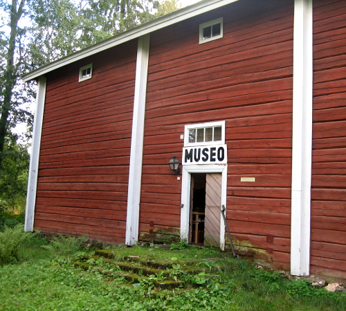

# Enon kyydissä TESTI





Eno-Seura ry. toimii Enossa sivistyksellisten, sosiaalisten ja taloudellisten olojen kehittämiseksi sekä viihtyisyyden lisäämiseksi lähtökohtanaan alueellinen omaleimaisuus ja paikalliset erityispiirteet.

Periaatteisiin kuuluu kotiseututyö entisen Enon kunnan alueen parhaaksi paikalliskulttuurin, ympäristönsuojelun, maisemanhoidon ja matkailun aloilla sekä toiminta asukkaiden ja eri yhteisöjen yhdyssiteenä.

Eno-seura osallistuu aluesuunnitteluun, tekee aloitteita ja antaa lausuntoja viranomaisille, tekee yhteistyötä kotiseututyön keskusjärjestöjen kanssa, suorittaa ja tukee kotiseutua koskevaa tallennus-, tutkimus- ja julkaisutoimintaa sekä järjestää kokous-, luento-, taide-, viihde- ja esitelmätilaisuuksia.

Yksi seuran näkyvimmistä toimintamuodoista on Enon kotiseutumuseon ja museoalueen ylläpitäminen ja kunnostaminen. Seura myös opastaa Enoa koskevassa historiassa.

Eno-Seura toimii yhteistyössä Joensuun kaupungin, Enon seurakunnan sekä alueen lukuisten yhdistysten kanssa.  Jos haluat tuoda esille ideoitasi tai toivot seuralta toimenpiteitä, otathan yhteyttä yhdistyksen johtokuntaan tai yhteydenottolomakkeen avulla.         


TODO "otathan yhteyttä" linkki

