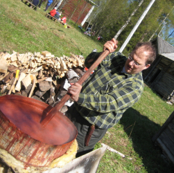
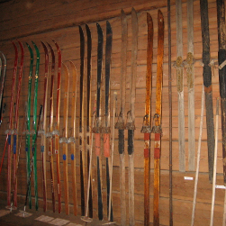





# Kotiseudun puolesta!
Eno-seura tekee perinteeseen pohjautuvaa kotiseututyötä pitämällä avoinna kotiseutumuseota ja tehdasperinnepolkua, ottamalla vastaan museoesineistöä, järjestämällä tilaisuuksia, ja antamalla lausuntoja kotiseudun asioista.  Seura osallistuuvuosittain valtakunnallisille kotiseutupäiville. Seurassa on n. 50 henkilöjäsentä.

 
 
 
 





# Enon kotiseutumuseo

Eno-seura vastaa Enon kotiseutumuseon ylläpidosta ja aukiolosta. 

Enon kotiseutumuseo sijaitsee keskellä Enon  kirkonkylää. Museo toimii vuonna 1853 rakennetussa lainajyvästössä. Siellä on nähtävänä muun muassa talonpoikaisesineistöä sekä Oy Kaukas Ab:n Kaltimon pahvitehtaan näyttelyosasto. Museoalueelta löytyy lisäksi pirtti, savusauna, riviaitta, ulkovarasto, maitolaituri sekä tuulimylly. 


Kuvat kuntoon sekä responsiiviseksi
